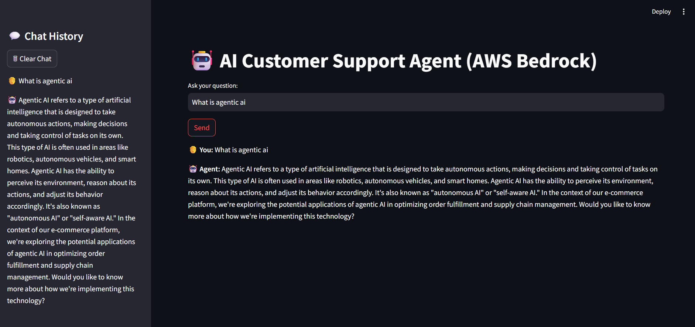

# 🤖 AI Support Agent (Bedrock)

[](LICENSE)
[](https://www.python.org/)
[](https://streamlit.io/)
[](https://aws.amazon.com/bedrock/)

An AI-powered customer support agent that routes user queries through a tiered pipeline - **FAQ matching → intent detection → LLM fallback (AWS Bedrock)** - with persistent session memory, built on Streamlit.

Rather than sending every message to an LLM, the agent resolves common queries instantly and only falls back to a foundation model for genuinely open-ended requests, keeping the system fast, predictable, and cost-efficient.

---

## Table of Contents

- [Overview](#overview)
- [Architecture](#architecture)
- [Features](#features)
- [Tech Stack](#tech-stack)
- [Project Structure](#project-structure)
- [Getting Started](#getting-started)
- [Configuration](#configuration)
- [Usage](#usage)
- [Screenshots](#screenshots)
- [Roadmap](#roadmap)
- [Author](#author)
- [License](#license)

---

## Overview

Most support chatbots either hardcode rigid rules or send every message straight to an LLM. This project takes a **tiered routing approach**:

| Stage | What it handles | Cost / Latency |
|---|---|---|
| 1. Intent Detection | Complaint → support ticket, request → email routing | Instant, free |
| 2. FAQ Matching | Refunds, delivery times, order tracking | Instant, free |
| 3. LLM Fallback | Anything open-ended or unmatched | Slower, incurs Bedrock cost |

Each session is tracked with a UUID, and conversation history persists across turns so the LLM fallback has short-term context instead of answering in isolation.

## Architecture

```
User Input
    │
    ▼
┌─────────────────────┐
│  Intent Detection    │──► EMAIL   → send_email()
│  (tools.py)          │──► TICKET  → create_ticket()
└─────────┬────────────┘
          │ GENERAL
          ▼
┌─────────────────────┐
│  FAQ Matching        │──► Match found → instant answer
│  (tools.py)          │
└─────────┬────────────┘
          │ No match
          ▼
┌─────────────────────┐
│  Prompt Builder       │  (recent session history + system prompt)
│  (agent.py)           │
└─────────┬────────────┘
          ▼
┌─────────────────────┐
│  AWS Bedrock LLM      │──► Generated response
└─────────┬────────────┘
          ▼
   Response + saved to
   chat_history.json (memory.py)
```

## Features

- 🎯 **Intent-first routing** - complaint and email-style messages are routed correctly before FAQ or LLM logic runs
- 📌 **Instant FAQ answers** for common queries (refunds, delivery, order tracking)
- 🧠 **Context-aware LLM fallback** - recent conversation turns are included in the Bedrock prompt so responses stay relevant and non-repetitive
- 🎫 **Automatic ticket generation** with unique IDs and timestamps
- 💬 **Streamlit chat UI** with sidebar session history
- 🗂️ **Lightweight, thread-safe JSON session memory** - no database dependency

## Tech Stack

| Layer | Technology |
|---|---|
| UI | Streamlit |
| LLM | AWS Bedrock (model-agnostic via `MODEL_ID`) |
| Language | Python 3.9+ |
| Cloud SDK | boto3 |
| Storage | JSON file-based session memory |

## Project Structure

```
ai-support-agent-bedrock/
├── app.py                 # Streamlit UI — session handling, chat loop
├── agent.py                # Routing logic: intent → FAQ → LLM fallback; prompt builder
├── tools.py                 # FAQ answers, ticket creation, email handler, intent detection
├── memory.py                 # Thread-safe JSON chat history persistence
├── config.py                  # AWS Bedrock client setup
├── screenshots/                # UI screenshots used in this README
├── chat_history.json           # Auto-generated session logs
├── support ques.txt             # Sample queries used for manual testing
├── requirements.txt
├── LICENSE                       # MIT
└── README.md
```

## Getting Started

### Prerequisites

- Python 3.9+
- An AWS account with **Bedrock model access** enabled for your chosen `MODEL_ID`
- AWS credentials with `bedrock:InvokeModel` permission

### Installation

```bash
git clone https://github.com/Gayathri-Reddy874/ai-support-agent-bedrock.git
cd ai-support-agent-bedrock
pip install -r requirements.txt
```

## Configuration

Create a `.env` file in the project root:

```env
AWS_ACCESS_KEY_ID=your_key
AWS_SECRET_ACCESS_KEY=your_secret
AWS_REGION=your_region
MODEL_ID=your_bedrock_model_id
```

> ⚠️ Never commit `.env` - add it to `.gitignore`. The current Bedrock request body targets Llama-family models (`prompt` / `max_gen_len`); switching to Titan, Claude, or another model family on Bedrock requires updating the request/response shape in `agent.py`'s `invoke_bedrock()`.

## Usage

```bash
streamlit run app.py
```

Open the local URL Streamlit prints (typically `http://localhost:8501`). Type a question — e.g. *"What is the refund policy?"* or *"My order is not delivered"* - and the agent will route it through FAQ, ticketing, or the LLM automatically. Use **🗑 Clear Chat** in the sidebar to start a fresh session.

## Screenshots

**App Preview**


**Sample Result**


## Roadmap

- [ ] Swap JSON storage for a proper database (DynamoDB/SQLite) for multi-user scale
- [ ] Add retrieval-augmented generation (RAG) over a real knowledge base instead of static FAQ keywords
- [ ] Support additional Bedrock model families out of the box
- [ ] Add automated tests for intent routing and FAQ matching

## Author

**Mallareddygari Gayathri**

GitHub: [@Gayathri-Reddy874](https://github.com/Gayathri-Reddy874)

## License

Distributed under the **MIT License**. See [`LICENSE`](LICENSE) for details.
